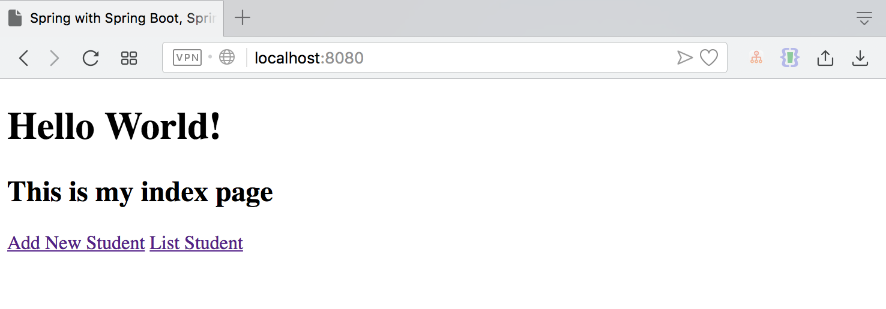
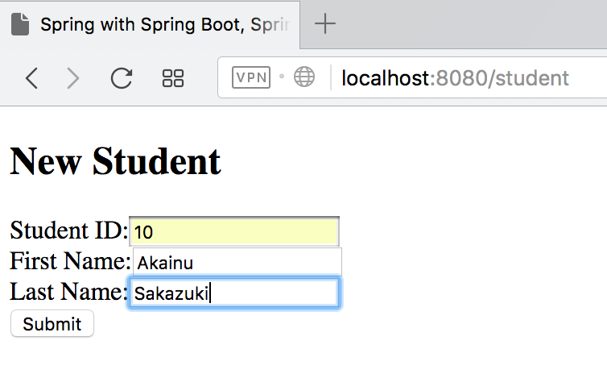
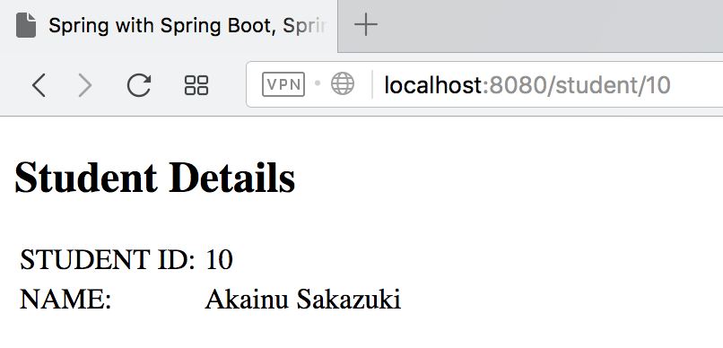
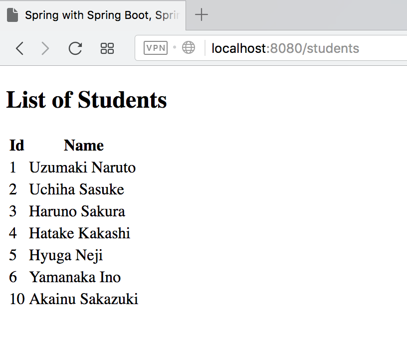

# Spring Boot Kotlin Thymeleaf Example

Spring MVC with Spring Boot, Kotlin, and Thymeleaf

| URL                   | HTTP METHOD   | DESCRIPTION |
| ----------------------|---------------|-------------|
| /students             | GET	        | Lists all student records|
| /student/{studentId}	| GET	        | Searches for a student record by Id|
| /student	            | POST	        | Creates a new student record and displays it|
| /student	            | GET	        | Displays the form where users input the student data and submit the form to create a new student record in the application|
| /	                    | GET	        | Displays an index page|

Screenshot :

Index Page

Add New Student Page

Student Details Page

List Student Page

